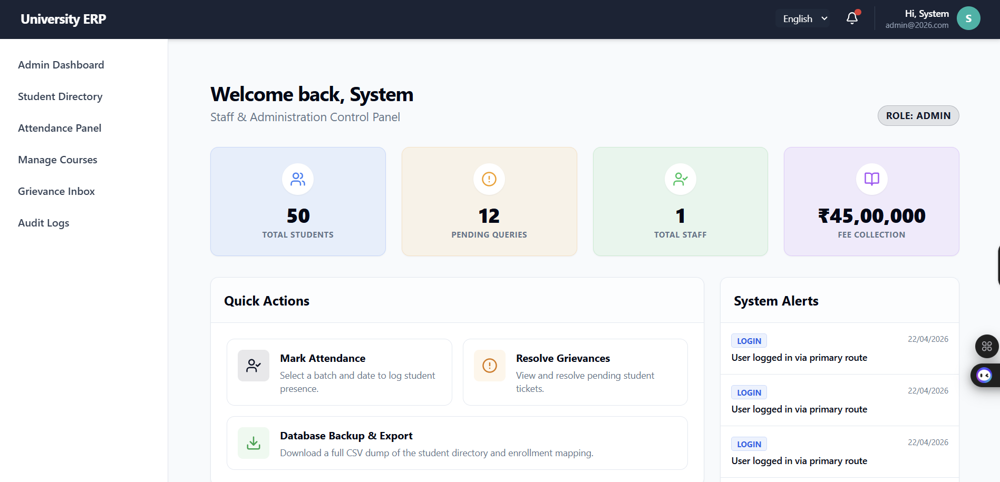

<div align="center">
  
  
  <br/><br/>
  
  

  <p>
    <em>A beautifully crafted, high-performance Campus Management System designed to bridge the gap between Administration, Faculty, and Students.</em>
  </p>

  <p>
    <a href="#-core-features"></a>
    <a href="#-quick-start-guide"></a>
    <a href="#-technology-stack"></a>
  </p>
</div>

<hr/>

## 🌟 Core Features

This ERP is loaded with everything a modern institution needs, presented in a clean and intuitive interface.

> ### 🎓 For Students
> - **Secure Portal:** Access grades, attendance, and fee status from anywhere.
> - **Performance Analytics:** Track academic growth with interactive, beautiful charts.

> ### 👨‍🏫 For Faculty
> - **Smart Classroom:** Automated grade calculation and syllabus tracking.
> - **Streamlined Workflow:** Request and manage leaves without paperwork.

> ### 🏛️ For Administration
> - **Total Control:** Granular Role-Based Access Control (RBAC) to ensure security.
> - **Instant Reporting:** Generate detailed CSV & PDF reports at the click of a button.

> ### 🔔 Advanced Integrations
> - **Notifications:** Real-time SMS alerts via Twilio & structured Emails via Nodemailer.
> - **Live Communication:** Instant messaging and alerts powered by Socket.io.

<br/>

## 📸 Interface Preview

<div align="center">
  
  <p><i>System Dashboard</i></p>
</div>

<br/>

## 🚀 Technology Stack

Built with cutting-edge tools to ensure scalability, security, and a flawless developer experience.

<div align="center">
  
</div>

<br/>

| **Layer** | **Technologies Used** |
| :--- | :--- |
| **Frontend** | React 19 (Vite), Tailwind CSS, React Hook Form, Zod, Lucide Icons |
| **Backend** | Node.js, Express.js, MongoDB (Mongoose), Socket.io |
| **Security** | JWT Authentication, Bcrypt, Helmet, Express Rate Limit |
| **Services** | Twilio (SMS), Nodemailer (Email), Cloudinary (Assets), PDFKit |

<br/>

## ⚡ Quick Start Guide

Get the project running on your local machine in minutes!

### Prerequisites
Make sure you have **Node.js (v18+)** and **MongoDB** installed on your system.

### 1. Clone & Setup Backend
```bash
# Clone the repository
git clone https://github.com/walterhydra/College_Managment_System.git
cd College_Managment_System/server

# Install backend dependencies
npm install

# Start the backend server (Ensure your .env is configured first!)
npm run dev
```

### 2. Setup Frontend
Open a new terminal window:
```bash
cd College_Managment_System/client

# Install frontend dependencies
npm install

# Start the Vite development server
npm run dev
```

<br/>

## 🤝 How to Contribute

We welcome contributions! If you have a suggestion that would make this better, please fork the repo and create a pull request.

1. **Fork** the Project
2. **Create** your Feature Branch (`git checkout -b feature/AmazingFeature`)
3. **Commit** your Changes (`git commit -m 'Add some AmazingFeature'`)
4. **Push** to the Branch (`git push origin feature/AmazingFeature`)
5. **Open** a Pull Request

<br/>

## 📄 License

This project is open-source and available under the **MIT License**.

<hr/>

<div align="center">
  
  <br/>
  <p>Designed & Developed with ❤️ by Walterhydra</p>
</div>
